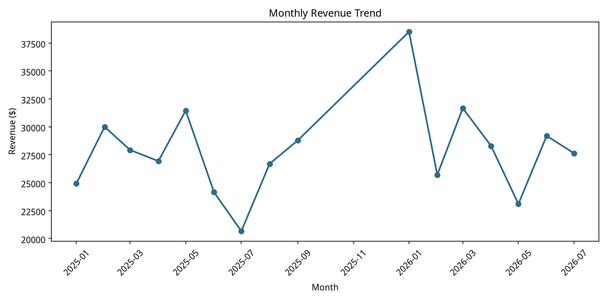
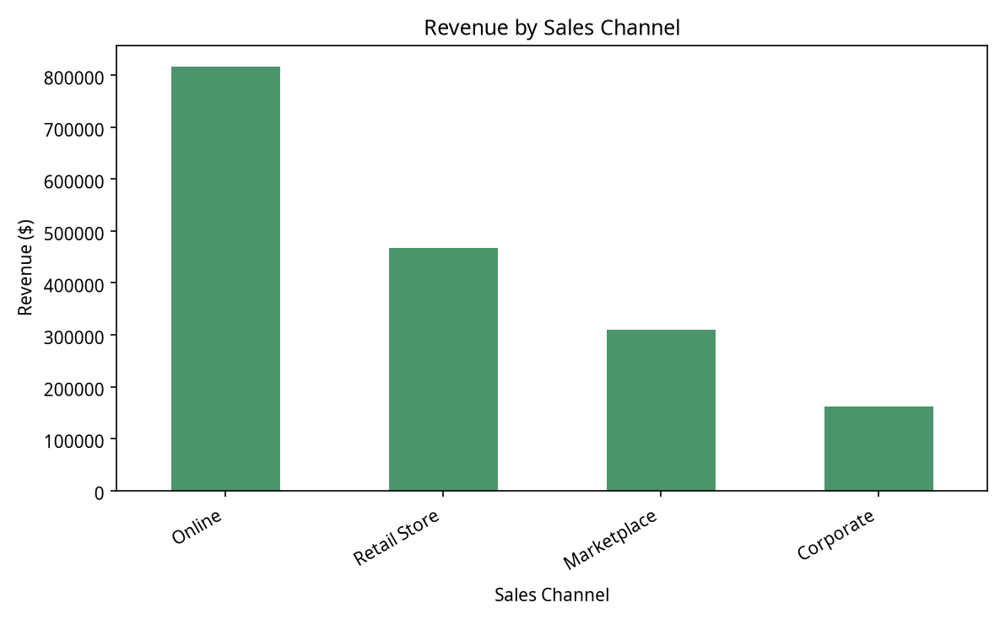
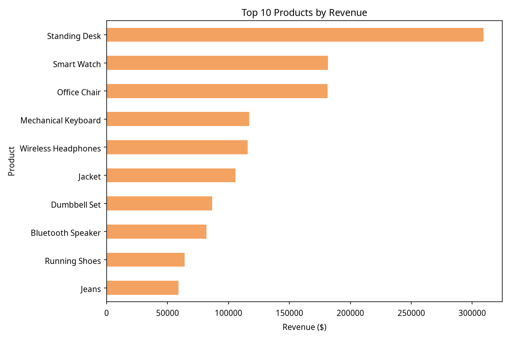
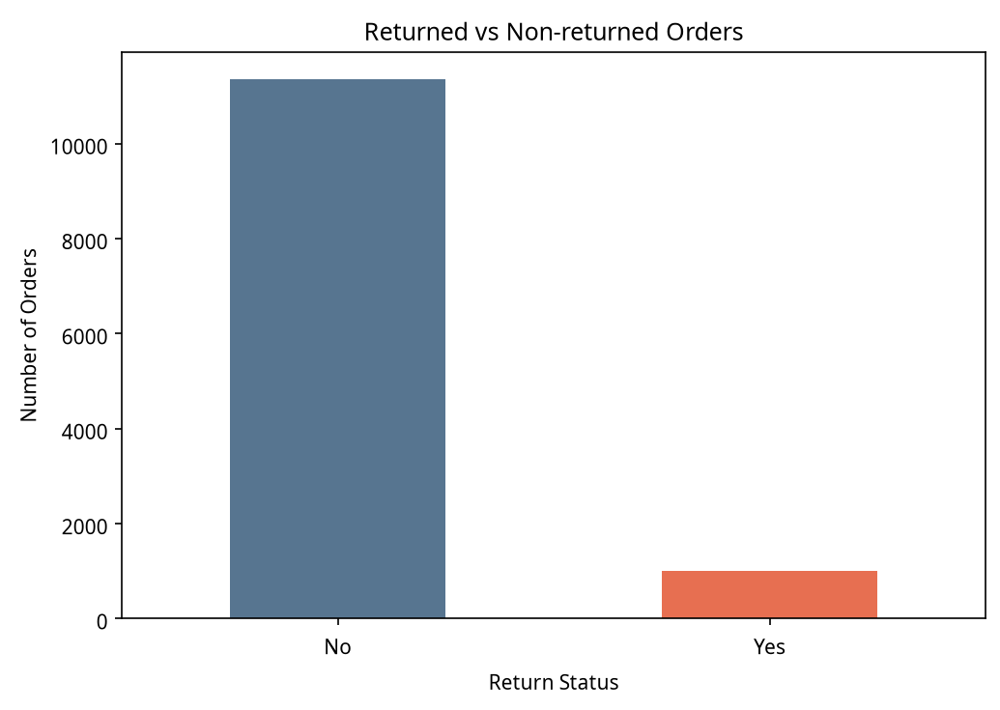

# E-commerce Sales Analysis

A beginner-friendly analysis of e-commerce transactions using **Python, Pandas, Matplotlib, and Jupyter Notebook**. The project demonstrates data cleaning, exploratory analysis, KPI calculation, revenue analysis, sales-channel comparison, product performance, and return analysis.


## Project Overview

This project examines customer, product, order, payment, shipping, and return information in an e-commerce dataset. The notebook cleans the included dataset, calculates revenue, summarizes the main business metrics, and presents four focused visualizations.

## Objectives

The analysis answers practical questions about total revenue, order volume, customer activity, product performance, sales channels, returned orders, and monthly revenue patterns.

## Tools and Technologies

- Python
- Pandas
- Matplotlib
- Jupyter Notebook

## Dataset

The repository includes both the original raw dataset and the cleaned dataset used by the notebook:

- `python_data_analytics_ecommerce_raw.csv` — the original raw e-commerce data.
- `python_data_analytics_ecommerce_raw_cleaned.csv` — the cleaned dataset used directly by the notebook.

`python_data_analytics_ecommerce_raw_cleaned.csv`

The cleaned file contains **12,350 records and 18 columns**, including the original transaction fields plus the calculated `Revenue` and `Month` columns. The notebook reads this repository file directly, so no separate data download or local machine path is required.

The original cleaning workflow documented in the notebook includes duplicate removal, categorical text standardization, numeric conversion for `UnitPrice`, date conversion for `OrderDate`, missing-value handling, and the revenue calculation:

```text
Revenue = Quantity × UnitPrice × (1 - Discount)
```

## Analysis Performed

The notebook covers:

- Dataset inspection and data-type review
- Missing-value and duplicate-row checks
- Text standardization for categorical columns
- Unit-price and date conversion
- Revenue calculation
- KPI calculation for revenue, orders, customers, and average order value
- Revenue summaries by product, region, customer type, and sales channel
- Returned versus non-returned order analysis
- Monthly revenue analysis for rows with valid order dates
- Four Matplotlib visualizations saved in the `images/` folder

## Analysis Preview

The charts below are generated from the project dataset and are also created when the notebook is run.

### Monthly Revenue Trend



### Revenue by Sales Channel



### Top 10 Products by Revenue



### Returned vs Non-returned Orders



## Key Insights

Using the calculations already present in the notebook, the project reports:

- **Total revenue:** $1,756,117.01
- **Total orders:** 12,350
- **Unique customers:** 5,115
- **Average order value:** $142.20
- **Highest-revenue customer type:** Returning customers, with $985,307.35
- **Highest-revenue sales channel:** Online, with $816,386.02
- **Highest-revenue region:** West, with $394,499.42
- **Highest-revenue product:** Standing Desk, with $309,175.11
- **Returned orders:** 1,000, compared with 11,350 non-returned orders
- **Highest monthly revenue in the available dated records:** January 2026, with $38,512.10

The monthly chart uses rows with valid `OrderDate` values. The included cleaned data contains missing dates, so undated rows are not assigned to a month.

## How to Run

1. Clone the repository:

   ```bash
   git clone https://github.com/youmna24zaian/ecommerce-sales-analysis.git
   cd ecommerce-sales-analysis
   ```

2. Install the required packages:

   ```bash
   python -m pip install -r requirements.txt
   ```

3. Open the notebook:

   ```bash
   jupyter notebook ecommerce_sales_analysis.ipynb
   ```

4. Run the notebook cells sequentially. The notebook reads the included cleaned CSV and regenerates the chart files in `images/`.

On some systems, use `python3` and `pip3` instead of `python` and `pip`.

## Project Structure

```text
ecommerce-sales-analysis/
├── README.md
├── requirements.txt
├── ecommerce_sales_analysis.ipynb
├── python_data_analytics_ecommerce_raw.csv
├── python_data_analytics_ecommerce_raw_cleaned.csv
└── images/
    ├── ecommerce-sales-analysis-thumbnail-v1.png
    ├── ecommerce-sales-analysis-thumbnail-v2.png
    ├── monthly_revenue_trend.png
    ├── revenue_by_channel.png
    ├── top_10_products.png
    └── returned_vs_non_returned.png
```

## Reference

The project was practiced with the tutorial [Python for Data Analysis | Real-World Beginner Project with Pandas](https://youtu.be/mO8j0ixh-M0).

## Author

**Youmna Zaian** · [GitHub](https://github.com/youmna24zaian)
